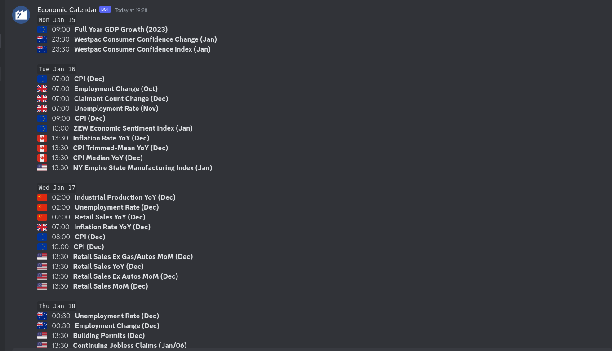

# News Keeper

News Keeper is an Economic Calendar News discord bot

Inorder to get news simply type "news"



## Permissions Needed

- Send Messages in Threads
- Send Messages
- Mention Everyone
- Read Messages/View Channels
- Read Messae History

## Invite Me

Use this link to invite the bot to your channel:

<https://discord.com/api/oauth2/authorize?client_id=1196091282792136794&permissions=274878106624&scope=bot>

## Usage

Type 'news'

## Development

**1. Clone Me**

```sh
git clone https://github.com/takumade/economic_calendar_bot
```

**2. Create a virtual environment**

```sh
virtualenv venv
```

**3. Activate it**

```sh
source venv/bin/activate
```

**4. Install dependencies**

```sh
pip install -r requirements.txt
```

Inside the .env file add your DISCORD TOKEN

**5. Run it**

```sh
python main.py
```


## CONTRIBUTIONS

### Code

1. Fork the repo
2. Create a branch
3. Add your miserable contribution(s)
   
   

4. Create a pull request stating what changes you added etc
5. Then I merge your changes

### Suggestions

1. DM me on twitter [takucoder](https://twitter.com/takucoder)
2. OR raise an Issue

#### No unclear or useless contributions please

## Special Thanks

- [Federico Azzurro](https://github.com/federicoazzu)
- [Takunda Madechangu](https://github.com/takumade)
